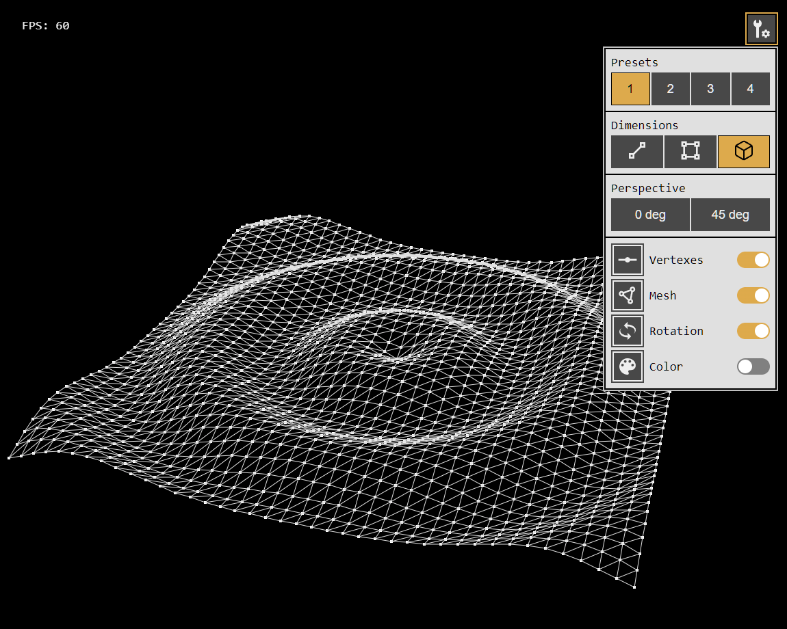

# Oscillations3D

[Live demo](https://alexander-lyakhov.github.io/os3d/)

|Keyboard shortcuts  | Action|
|--------------------|--------|
| `1`, `2`, `3`, `4` | Select preset
| `Q`, `W`, `E`      | Select projection
| `A`, `S`           | Select view angle
| `T`                | Show / Hide settings panel
| `R`                | Toggle rotation
| `C`                | Toggle color
| `V`                | Toggle vertexes
| `M`                | Toggle1 mesh

